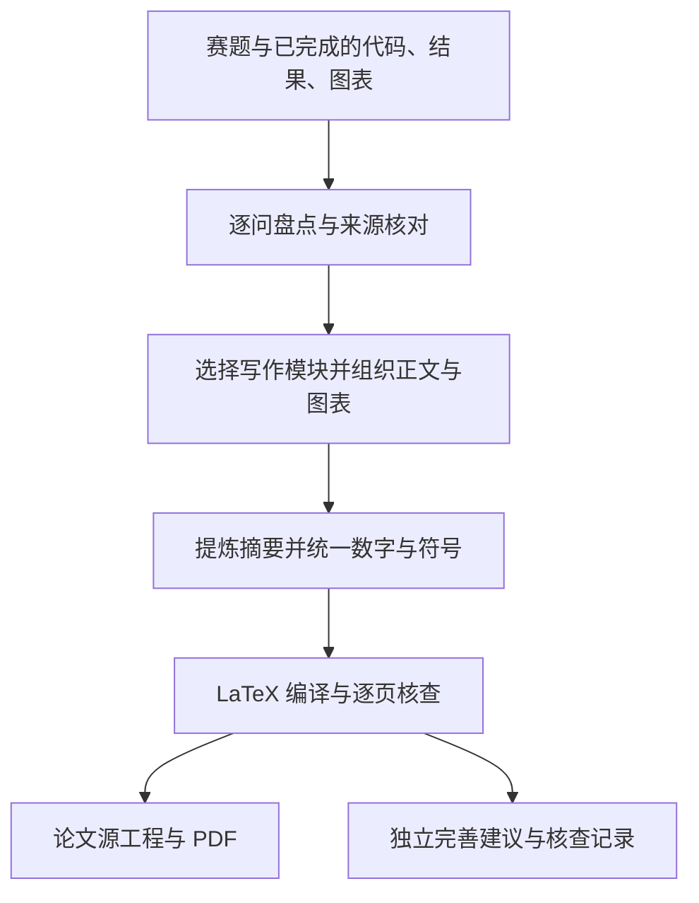

# CUMCM LaTeX Paper Skill

**把已经完成的数学建模成果，整理成论证清楚、结果可追溯的中文 LaTeX 论文。**

代码已经跑通，结果和图片也已准备好，接下来的工作是把建模过程讲清楚：为什么采用这个模型，公式如何对应实现，每一问得到了什么答案，图表又能支持哪些结论。

`cumcm-latex-paper` 围绕这一写作阶段组织 AI 助手的工作。项目包含分题型写作规则、摘要提炼规范、参考论文索引、LaTeX 模板和检查脚本，支持整篇成稿、单问撰写、摘要修改与已有论文审校。

[技能入口](SKILL.md) · [LaTeX 模板预览](assets/latex-template-preview.pdf) · [论文完善建议模板](assets/review/论文完善建议.md)

## 适合什么时候使用

当项目已经具备赛题、实际采用的代码、对应运行结果、各问答案和已有图表时，即可进入写作。助手会从现有文件中整理方法与证据，无需作者先重新填写一套建模笔记。

模型对比和敏感性分析可以按实际完成情况处理：已有结果就纳入；未完成且题目未要求时可以省略。若缺少题目必答内容，则继续完成可写部分，并在独立建议文档中说明关键缺口与草稿状态。

仅有赛题、尚未完成模型求解时，应先完成研究与计算，再使用本 skill 成稿。

## 主要特点

| 特点 | 具体做法 |
|---|---|
| 从代码还原模型 | 阅读实际执行链，解释变量、关系式、目标、约束和求解过程，使正文与实现对应 |
| 按每问任务选择写法 | 组合机理、优化、统计模块，适配 A/B/C 题中的不同任务与混合问题 |
| 核对结果来源 | 追踪关键数字与运行版本，使用统一结果命令保持摘要、正文和表格口径一致 |
| 摘要最后提炼 | 从完成的正文中提炼关键处理、模型机制与答案，突出每问真正有辨识度的工作 |
| 逐问规划图表 | 检查总体流程、开篇数据侧写和每问核心结果，优先使用有解释价值的主图或组合图 |
| 简洁的模型评价 | 末尾只设“模型优点”和“模型缺点”；优点有依据，缺点聚焦少量真实的局部不足 |
| 独立的完善建议 | 单独交付 `论文完善建议.md`，说明缺口、配图和版式改进，由作者选择是否采纳 |
| 完整的 LaTeX 交付 | 提供分章节工程、来源记录、构建脚本及核查流程，要求编译后逐页检查 PDF |

### 按数学任务适配题型

A/B/C 字母用于检索参考资料，具体写法由每问需要回答的问题决定。

| 任务类型 | 写作重点 |
|---|---|
| 机理、几何、动力系统、参数反演 | 坐标、量纲、物理关系、初边值、参数及适用条件 |
| 优化、路径、调度、资源配置 | 决策变量、目标函数、逐类约束、可行性及实际求解状态 |
| 统计推断、预测、分类、综合评价 | 样本单位、信息时点、数据划分、估计方法和评价口径 |
| 预测接优化等混合任务 | 各模型的输入输出关系、单位及误差传递 |

同一篇论文可以组合多个模块，同时保持统一的术语、符号和图表风格。

### 让图表帮助读者理解结果

skill 会围绕三个位置检查图表是否充分：

- **问题分析**：总体流程图是否清楚展示输入、共享处理、各问模型和输出。
- **数据概况与预处理**：分布、时序、分组或空间图是否能够解释后续建模选择。
- **每问结果**：是否有直观呈现核心答案的主图或组合图，并保留必要的精确数值表。

补图建议会写清图型、变量与单位、数据来源、建议位置和阅读价值。仅有单个数值或简短理论结论时，按内容选择文字或表格，不机械凑图。

### 把完善意见单独交给作者

`论文完善建议.md` 集中记录当前稿的关键缺口、逐问配图盘点和表达改进。每项建议区分“关键待核查 / 优先完善 / 可选美化”，并支持“待决定 / 采纳 / 暂缓 / 不采纳 / 已完成”。

建议文档独立于正文和附录，作者可以在收到本轮论文后决定下一步。影响结论成立的必要条件仍会在相关模型或结果处说明；原题明确要求的改进任务仍在对应问题章节回答。

## 快速开始

### 1. 放置完整技能目录

将整个 `cumcm-latex-paper` 文件夹放入解题项目中，保留其中的 `references/`、`assets/` 和 `scripts/`。也可以将技能放在其他位置，调用时提供实际路径。

以下仅为示意，已有成果无需按此结构重新整理：

```text
解题项目/
├── 赛题.pdf
├── code/                  # 已采用的代码与配置
├── data/                  # 数据与附件
├── results/               # 实际运行结果、日志与答案
├── figures/               # 已有图表
└── cumcm-latex-paper/      # 完整技能目录
    ├── SKILL.md
    ├── references/
    ├── assets/
    └── scripts/
```

### 2. 明确指定技能入口

在能够读取本地项目文件的 AI 助手中打开解题项目，使用下面的提示词。需要生成 PDF 时，助手还应能执行本地编译命令。

```text
请读取当前项目中的 cumcm-latex-paper/SKILL.md。
根据赛题、已经完成的代码、实际运行结果、各问答案和图表，
撰写中文数学建模论文，输出到 paper/，交付完整 LaTeX 工程和编译后的 PDF。

从代码还原实际方法，核对每问答案及关键数字的来源。
模型对比和敏感性分析只写确实完成的内容；未做且题目未要求时可以省略。
模型评价只写模型优点和简短的模型缺点，摘要在正文完成后提炼。
另交付“论文完善建议.md”，分析关键缺口、流程图、数据侧写、每问结果配图
和版式的改进空间，写清依据及建议位置，供作者决定是否采纳。
```

放入文件夹后仍应明确要求助手读取 `SKILL.md`。脚本负责初始化、检查和编译，论文正文由助手依据技能规则与项目成果撰写。

### 3. 也可以只处理一个部分

**只写问题二：**

```text
请读取 cumcm-latex-paper/SKILL.md，只根据问题二的代码、结果和图表撰写该问章节，
输出可并入主工程的 LaTeX，并给出仅针对本问的完善建议。
```

**重写摘要：**

```text
请读取 cumcm-latex-paper/SKILL.md，根据已有正文和核定结果重写摘要，
突出各问的关键机制与答案，逐句核对数字和结论，不增加正文没有的事实。
```

**审校已有论文：**

```text
请读取 cumcm-latex-paper/SKILL.md，检查当前 LaTeX 论文与代码、运行结果是否一致，
修正论证、图表引用和排版问题，并单独更新“论文完善建议.md”。
```

## 工作流程与交付内容



| 交付物 | 用途 |
|---|---|
| `main.tex`、分章节源文件及配套资源 | 继续修改、编译和整理提交材料 |
| `build/main.pdf` | 查看本次实际编译的论文 |
| `论文完善建议.md` | 审阅缺口、配图方案与可选改进，记录作者选择 |
| `evidence.json`、`写作核查.md` | 追踪关键结果来源、核查过程和处理状态 |
| 编译日志与构建记录 | 定位编译问题，核对 PDF 是否对应当前源文件 |

没有可用编译环境时交付源工程并说明未编译状态；核心答案尚不完整时交付草稿及对应说明。

## 环境与辅助脚本

常规使用由 AI 助手完成文件整理和调用。需要手动运行脚本时，准备：

- Python 3.9 或更新版本。
- 可用的 XeLaTeX 环境，包含 `ctex` 及模板使用的宏包和中文字体；使用文献引用时还需要 BibTeX。
- PDF 查看或渲染工具，用于编译后的逐页检查。

以下命令在上面的“解题项目”根目录执行。

**初始化空白工程：**

```bash
python -X utf8 cumcm-latex-paper/scripts/init_paper.py --output paper --source-root .
```

输出目录必须为空。初始化器复制 LaTeX 骨架和独立建议文档模板，创建核查记录。

**完成正文、填写并核对结果记录后：**

```bash
python -X utf8 cumcm-latex-paper/scripts/check_paper.py paper --write-results
python -X utf8 cumcm-latex-paper/scripts/build_paper.py paper
python -X utf8 cumcm-latex-paper/scripts/check_paper.py paper --final
```

正式检查前应替换全部填写提示，并将 `main.tex` 中的 `\PaperDrafttrue` 改为 `\PaperDraftfalse`。更多细节见 [LaTeX 工作流](references/latex-workflow.md)。

## 项目结构

```text
cumcm-latex-paper/
├── README.md                     # 项目介绍与快速开始
├── SKILL.md                      # 技能入口与整体工作流程
├── agents/                       # 技能界面元信息
├── references/                   # 题型、正文、摘要、图表与核查规则
│   ├── corpus-index.md           # 参考论文索引与提炼
│   └── revision-advice.md        # 独立完善建议的写法
├── assets/
│   ├── latex/                    # 分章节 LaTeX 骨架
│   ├── review/                   # 论文完善建议模板
│   ├── corpus/                   # 参考论文材料
│   └── latex-template-preview.pdf
├── scripts/                      # 初始化、静态检查、编译及测试
└── LICENSE.upstream              # 上游项目许可说明
```

## 验证与适用范围

本地已通过 14 项脚本行为测试，并完成 XeLaTeX 模板编译、逐页预览检查及包含 BibTeX 的合成工程构建测试。模板预览中的灰字是填写提示，供查看排版结构。

检查脚本可发现部分来源缺失、结果冲突、缺图、引用错误和陈旧构建问题。论文的研究正确性、论证质量与最终版式仍需结合原始成果审阅；当前验证尚未覆盖任意赛题的完整成稿效果。

模板以国赛论文写作为主要场景，使用时按实际年份、比赛和赛区要求核对格式。最终论文质量取决于模型、计算、证据与表达共同完成的程度。

## 资料与致谢

项目整理了数学建模论文、写作规范、摘要指南与模板中的可复用经验，按需参考相关章节，重点学习论证组织和图表表达。资料取舍见 [来源说明](references/source-decisions.md)，论文署名与检索信息见 [参考论文索引](references/corpus-index.md)。

部分组织思路及检索材料参考了 [Mr-potato-123/cumcm-paper-hand-skill](https://github.com/Mr-potato-123/cumcm-paper-hand-skill)，保留 [上游许可说明](LICENSE.upstream)。参考论文的著作权归各自作者所有，上游许可不代表对第三方论文的统一授权。
